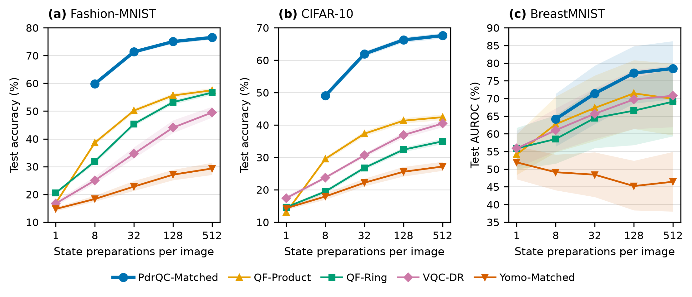

# QIML Real-Image Benchmark

Core code, experimental protocols, and numerical results for a controlled
comparison of quantum-derived and classical image representations. This is
the code-oriented companion to the AAAI Fall QIML 2026 work, not the complete
private research archive.

**Symposium context:** [Second AAAI Symposium on Quantum Information & Machine
Learning (QIML): Bridging Quantum Computing and Artificial Intelligence](https://aaai.org/conference/fall-symposia/2026-fall-symposium-series-2/#QIML).
This identifies the intended symposium; it is not a statement of paper acceptance.

The repository is private during release preparation. All documentation is in
English. No raw datasets, feature caches, trained checkpoints, prediction-level
records, credentials, or unrelated ISBI mammographic experiments are included.

## What is implemented?

```text
Image → frozen ImageNet ResNet-18 → 512D features
      → train-only standardization/PCA8 → eight clipped angles
      → quantum or matched classical representation
      → classifier → validation-only calibration → held-out evaluation
```

| Family | Implementations |
|:--|:--|
| Selected quantum-derived features | PdrQC-Matched: supervised Pauli selection and grouped measurements |
| Fixed quantum features | QF-Product, QF-Ring: two upload repetitions and a 48-observable readout |
| Trainable quantum models | VQC-DR, Yomo-Matched: differentiable eight-qubit statevectors |
| Quantum kernel | QK-IQP: fidelity kernel; shots are **per kernel entry** |
| Matched classical controls | C-LR, C-MLP, C-Poly, C-RBF, C-RFF, C-Trig |
| Image-level references | C-ResNet: linear head on frozen 512D features; C-CNN: compact image CNN |
| Exploratory extension | PdrQC product-RY PCA8/12/16 width sensitivity on MNIST/Fashion-MNIST |

Datasets: MNIST, Fashion-MNIST, CIFAR-10, and BreastMNIST. The primary inferential
family excludes MNIST. These are research benchmarks, not a clinical application.

## Quick start: no dataset, GPU, account, or quantum SDK required

Use Python 3.11 or 3.12. From a clone of this repository:

```bash
python -m venv .venv
source .venv/bin/activate
python -m pip install -c environment/core-constraints.txt -e '.[test]'
python -m pytest -q
python scripts/check_reference_results.py
qiml demo --output runs/demo
```

The last command creates a tiny **synthetic installation check**, fitting the
three primary feature methods on synthetic 512D inputs. It writes a validation
lock before reading test arrays. It is **not** a manuscript experiment, accuracy
claim, or replacement for the full validation protocol. Run directories must be
new; use `runs/demo2` for a second run.

For image extraction and VQC/Yomo/CNN training, install the optional PyTorch stack:

```bash
python -m pip install -e '.[images,test]'
python -m pytest -q
```

Torch tests are explicitly skipped when that optional dependency is absent.
No IonQ, CUDA-Q, Qiskit, QPU account, or API key is needed by this benchmark.

## Run a new feature experiment

Supply **two separate NPZ files**, created from your legally obtained data:

| File | Required arrays |
|:--|:--|
| `train_val.npz` | `train_features [N,512]`, `train_labels [N]`, `val_features [V,512]`, `val_labels [V]` |
| `test.npz` | `test_features [T,512]`, `test_labels [T]` |

Use finite floating-point features and contiguous integer labels `0..K-1`, with
`K=2` or `10`. Keep partitions disjoint; the caller is responsible for the split.

```bash
qiml feature-run --train-val /path/to/train_val.npz \
  --test /path/to/test.npz --output runs/my_feature_experiment
```

This lightweight entry point uses a fixed `C=1` logistic readout, fresh train-only
PCA and validation-selected PdrQC structure. It fits only on training data,
calibrates on validation data, and then evaluates test. It does **not** reproduce
the full original hyperparameter search, finite-shot refitting, or 14-method
comparison. For those, follow [the full experiment guide](experiments/README.md).

## Inspect results and significance tests

Start with [the results guide](docs/RESULTS.md), then inspect:

- [Exact performance](results/reference/benchmark/tables/table_05_exact_performance.md)
- [Finite-shot performance](results/reference/benchmark/tables/table_06_finite_shot_performance.md)
- [Primary paired tests](results/reference/benchmark/statistics/primary_tests.csv)
- [Separate uncertainty tests](results/reference/benchmark/statistics/uncertainty_tests.csv)
- [Exploratory width tests](results/reference/width/statistics/exploratory_tests.csv)



Re-render the saved finite-shot estimates and intervals into a new directory:

```bash
python scripts/plot_reference_fig2.py --output runs/figure2
```

The included CSVs preserve the completed experiment's values. The scripts check
hashes and Holm adjustments; they do not infer new intervals from aggregate
means. Recomputing patient/image-level inference requires external prediction
artifacts, as explained in [STATISTICS.md](docs/STATISTICS.md).

## Main finding and claim limits

PdrQC-Matched was the strongest quantum-derived method at the controlled primary
scale, but the matched C-RBF control was significantly better on Fashion-MNIST
and CIFAR-10. BreastMNIST did not show a statistically detectable primary
difference; that does not establish equivalence. The PCA-width extension is
exploratory and does not establish a reliable improvement from more qubits.

Quantum results used CPU statevector simulation and offline sampling. They do
not demonstrate quantum advantage, hardware speedup, or medical superiority.

## Repository map

```text
src/qiml_benchmark/       Installable scientific core and experimental drivers
experiments/             Frozen reference configurations and experiment guide
scripts/                 Result checks, offline reanalysis, and plotting
tests/                   Numerical, gradient, portability, and workflow tests
results/reference/       Completed aggregate results and significance tables
docs/                    Methods, results, limitations, and selected figures
provenance/              Source lineage, checksums, and release verification
runs/                    Ignored local outputs; never a publication-results folder
```

Read [METHODS.md](docs/METHODS.md) for equations,
[PORTING_NOTES.md](docs/PORTING_NOTES.md) for changes from the original code,
and [REPRODUCIBILITY.md](docs/REPRODUCIBILITY.md) for what has and has not been
revalidated. A clean installation is not a claim of bitwise reproduction of
the historical scientific run.

## Before public release

Follow [PUBLIC_RELEASE_CHECKLIST.md](docs/PUBLIC_RELEASE_CHECKLIST.md). An
open-source license has **not** been selected on the author's behalf. Do not
change visibility or redistribute external data/checkpoints until authorship,
licensing, dataset terms, and the manuscript status have been reviewed.
